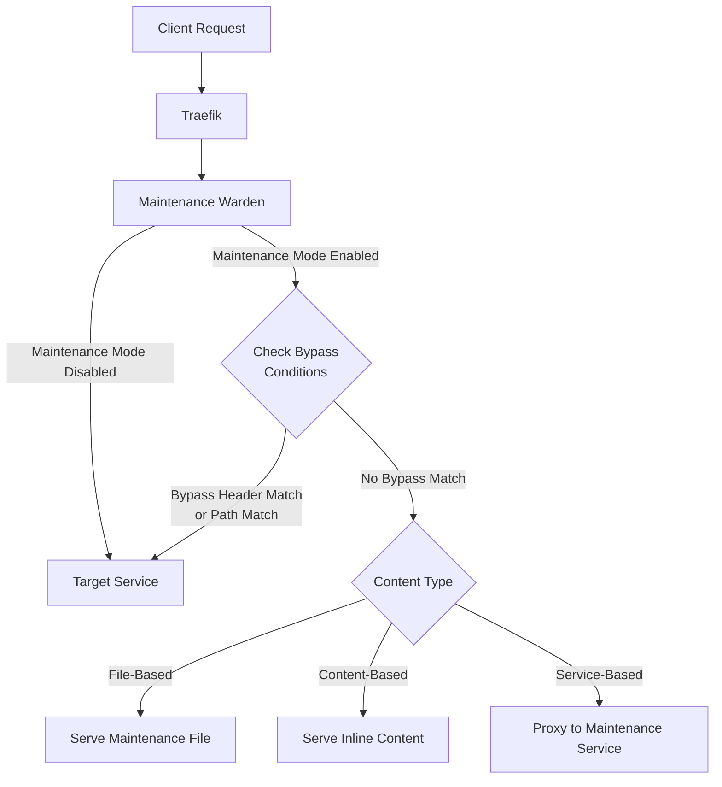

# Maintenance Warden: Flexible Maintenance Mode Plugin for Traefik

[](https://github.com/TechAlchemistry/traefik-maintenance-warden/actions/workflows/test.yml)
[](https://github.com/TechAlchemistry/traefik-maintenance-warden/actions/workflows/test.yml)
[](https://opensource.org/licenses/MIT)

**Professional service maintenance with intelligent bypass controls**

Maintenance Warden is a lightweight, high-performance middleware plugin for Traefik that provides a flexible maintenance mode solution for your services. It allows you to easily activate maintenance mode across your infrastructure while maintaining accessibility for authorized users through a configurable bypass header.

## Key Features

- **Triple-Mode Flexibility**: Choose between file-based, content-based, or service-based maintenance pages
- **Selective Access Control**: Maintain service access for authorized users via configurable bypass headers
- **Path-Based Exceptions**: Configure specific paths to bypass maintenance mode automatically
- **Low Overhead**: Minimal performance impact with optimized request handling
- **Kubernetes Ready**: Easily integrate with your Kubernetes configuration

This plugin serves a maintenance page when maintenance mode is enabled, while allowing requests with a specific bypass header to access the original service.

## How it Works

1. The middleware checks if maintenance mode is enabled
2. If disabled, all traffic passes through normally
3. If enabled, all incoming requests are checked for:
   - Presence of the bypass header with correct value
   - Whether the path starts with any of the configured bypass paths
   - Whether the request is for favicon.ico (if bypassFavicon is true)
4. If any bypass condition is met, the request proceeds to the intended service
5. If no bypass condition is met:
   - If `maintenanceContent` is set, the middleware serves the inline HTML content
   - If `maintenanceFilePath` is set, the middleware serves the static HTML file
   - If `maintenanceService` is set, the request is proxied to the maintenance service
   - The configured status code is used (default: 503)

### Data Flow Visualization



## Design Philosophy

This plugin is designed with a focus on simplicity and reliability for static maintenance pages. It is optimized for the common use case of serving a simple "We're down for maintenance" page, rather than complex dynamic content.

The plugin offers three ways to serve maintenance pages:
1. **File-based**: Serve a static HTML file directly from disk
2. **Content-based**: Serve inline HTML content defined in the configuration
3. **Service-based**: Proxy requests to a dedicated maintenance service

The file-based and content-based approaches are simpler and more reliable, while the service-based approach offers more flexibility for dynamic content.

## Configuration

### Static Configuration

```yaml
# Static configuration in YAML
experimental:
  plugins:
    maintenance-warden:
      moduleName: "github.com/TechAlchemistry/traefik-maintenance-warden"
      version: "v1.0.0"
```

### Dynamic Configuration

```yaml
# Dynamic configuration in YAML

# Example 1: Using a static HTML file (recommended for simple maintenance pages)
http:
  middlewares:
    maintenance-warden:
      plugin:
        maintenance-warden:
          maintenanceFilePath: "/path/to/maintenance.html"
          contentType: "text/html; charset=utf-8"
          bypassHeader: "X-Maintenance-Bypass"
          bypassHeaderValue: "true"
          enabled: true
          statusCode: 503
          bypassPaths:
            - "/health"
            - "/api/status"
          logLevel: 1

# Example 2: Using a maintenance service (to reroute requests to a maintenance service for dynamic content)
http:
  middlewares:
    maintenance-warden:
      plugin:
        maintenance-warden:
          maintenanceService: "http://maintenance-page-service.test-maintenance"
          bypassHeader: "X-Maintenance-Bypass"
          bypassHeaderValue: "true"
          enabled: true
          statusCode: 503
          bypassPaths:
            - "/health"
            - "/api/status"
          maintenanceTimeout: 10
          logLevel: 1

# Example 3: Using inline content (simplest option for basic maintenance pages)
http:
  middlewares:
    maintenance-warden:
      plugin:
        maintenance-warden:
          maintenanceContent: "<html><body><h1>Under Maintenance</h1><p>Our service is currently undergoing scheduled maintenance. We'll be back shortly.</p></body></html>"
          contentType: "text/html; charset=utf-8"
          bypassHeader: "X-Maintenance-Bypass"
          bypassHeaderValue: "true"
          enabled: true
          statusCode: 503
          bypassPaths:
            - "/health"
            - "/api/status"
          logLevel: 1
```

## Configuration Options

| Option | Type | Default | Description |
|--------|------|---------|-------------|
| `maintenanceService` | string | `""` | URL of the maintenance service to redirect to |
| `maintenanceFilePath` | string | `""` | Path to a static HTML file to serve (takes precedence over maintenanceService) |
| `maintenanceContent` | string | `""` | Direct HTML content to serve (takes precedence over maintenanceFilePath and maintenanceService) |
| `contentType` | string | `"text/html; charset=utf-8"` | Content type header when serving a static file |
| `bypassHeader` | string | `"X-Maintenance-Bypass"` | Name of the header that allows bypassing maintenance mode |
| `bypassHeaderValue` | string | `"true"` | Expected value of the bypass header |
| `enabled` | boolean | `true` | Controls whether maintenance mode is active |
| `statusCode` | integer | `503` | HTTP status code to return when in maintenance mode |
| `bypassPaths` | string[] | `[]` | List of path prefixes that should bypass maintenance mode |
| `bypassFavicon` | boolean | `true` | Controls whether favicon.ico requests bypass maintenance mode |
| `logLevel` | integer | `1` | Controls logging verbosity (0=none, 1=error, 2=info, 3=debug) |
| `maintenanceTimeout` | integer | `10` | Timeout in seconds for requests to the maintenance service |

## Technical Features

### 1. Content Serving Modes

#### File-Based Maintenance
- **Implementation**: Direct file serving from disk
- **Performance**: High performance with minimal latency
- **Caching**: File content is cached in memory for efficiency
- **Change Detection**: Checks file modification times to auto-reload
- **Resource Usage**: Minimal memory footprint (~size of HTML file)

#### Content-Based Maintenance
- **Implementation**: Direct string content serving from configuration
- **Performance**: Highest performance with zero latency
- **Simplicity**: No file access or network required
- **Deployment**: Content directly embedded in configuration
- **Resource Usage**: Minimal memory footprint (only size of content string)

#### Service-Based Maintenance
- **Implementation**: HTTP reverse proxy to maintenance service
- **Flexibility**: Supports dynamic content generation
- **Timeout Handling**: Configurable timeouts with fallback
- **Protocol Support**: Preserves original request methods and headers
- **Error Handling**: Graceful fallback on service errors

### 2. Request Bypass Logic

#### Header-Based Bypass
- **Security**: Supports custom header names and values
- **Implementation**: Simple string comparison for performance
- **Flexibility**: Both header name and expected value are configurable

#### Path-Based Bypass
- **Implementation**: Prefix matching for efficiency
- **Use Cases**: Ideal for health checks, API status endpoints
- **Configuration**: Array of path prefixes to bypass

### 3. Response Management

#### Status Code Control
- **Implementation**: Configurable HTTP status code
- **Default**: 503 Service Unavailable (SEO-friendly for maintenance)
- **Headers**: Adds maintenance-specific headers automatically

#### Content Type Control
- **Implementation**: Configurable content type header
- **Default**: "text/html; charset=utf-8"
- **Flexibility**: Supports any valid content type

## Choosing Between Maintenance Page Options

### Content-based Maintenance (Simplest)
- **Pros**: Simplest setup, no dependencies, fastest performance, no file/network access
- **Cons**: Content must be included directly in configuration, limited size
- **Best for**: Simple static maintenance messages with minimal content

### File-based Maintenance (Recommended for most cases)
- **Pros**: Simple, reliable, no network dependency, low overhead
- **Cons**: Static content only, must be deployed on each Traefik instance
- **Best for**: Most maintenance scenarios with simple static pages

### Service-based Maintenance
- **Pros**: Can serve dynamic content, centralized management
- **Cons**: Additional network dependency, higher latency, more points of failure
- **Best for**: Complex maintenance pages with dynamic content or when centralized management is required

## Security Best Practices

### Securing the Bypass Header

The bypass header mechanism allows authorized users to access the service during maintenance. To secure this feature:

1. **Use a non-obvious header name**: Avoid predictable names like `bypass` or `maintenance-bypass`
2. **Use a complex, random value**: Set a random string as the header value, not simple values like "true" or "1"
3. **Consider using HMAC**: For higher security, implement a time-based HMAC value mechanism
4. **Combine with IP restrictions**: When possible, restrict the bypass to specific IP addresses using Traefik's IPWhitelist middleware

### Maintenance Service Security

1. **Use internal routing**: Keep your maintenance service in a protected internal network
2. **Set appropriate cache headers**: Ensure browser caching headers are set correctly on maintenance pages
3. **Implement rate limiting**: Use Traefik's RateLimit middleware in front of both your regular and maintenance services
4. **Monitor for abuse**: Enable logging (logLevel 2+) to monitor for repeated bypass attempts 

## Maintenance Page Best Practices

For the best user experience, your maintenance page should:

1. **Be lightweight and static**: Avoid complex dynamic content during maintenance
2. **Include estimated downtime**: Let users know when to check back
3. **Provide alternative contact methods**: Offer email or social media links when applicable
4. **Use appropriate status codes**: The default 503 is typically best for maintenance

## Building and Testing

```bash
go mod tidy
go test ./...
```

## Kubernetes Integration

When using with Kubernetes, define a middleware resource:

```yaml
apiVersion: traefik.containo.us/v1alpha1
kind: Middleware
metadata:
  name: maintenance-warden
  namespace: test-maintenance
spec:
  plugin:
    maintenance-warden:
      # For static file - mount a ConfigMap as a volume
      maintenanceFilePath: "/config/maintenance.html"
      
      # Or for service-based
      # maintenanceService: "http://maintenance-page-service.test-maintenance"
      
      bypassHeader: "X-Maintenance-Bypass"
      bypassHeaderValue: "true"
      enabled: true
      statusCode: 503
      bypassPaths:
        - "/health"
        - "/api/status"
      logLevel: 1
```

## Comprehensive Example

Here's a more comprehensive configuration example showing all options:

```yaml
http:
  middlewares:
    secured-maintenance:
      plugin:
        maintenance-warden:
          # Choose one of these options:
          maintenanceFilePath: "/etc/traefik/maintenance.html"  # File-based (preferred)
          # maintenanceService: "http://maintenance.internal"  # Service-based
          # maintenanceContent: "<html><body><h1>Under Maintenance</h1><p>We'll be back soon.</p></body></html>"  # Content-based
          
          # Content settings (for file-based and content-based)
          contentType: "text/html; charset=utf-8"
          
          # Basic settings
          enabled: true
          statusCode: 503
          
          # Security options
          bypassHeader: "X-Service-Access-Token"  # Custom non-obvious name
          bypassHeaderValue: "8f4j9FjWm2kDp3VxZsA7"  # Random complex value
          
          # Path bypass options
          bypassPaths:
            - "/api/health"
            - "/metrics"
            - "/public/assets"
          bypassFavicon: true
          
          # Performance and debugging options
          logLevel: 2  # Info level logging
          maintenanceTimeout: 5  # 5 second timeout (for service-based only)
```

## Documentation

For more detailed information, see the documentation in the [spec](./spec) directory:

1. [**Technical Overview**](./spec/technical_overview.md) - Architecture, features, and technical implementation details
2. [**Audience and Use Cases**](./spec/audience_and_use_cases.md) - Target users and the problems the plugin solves
3. [**Deployment Guide**](./spec/deployment_guide.md) - How to deploy and configure the plugin in various environments
4. [**Benefits and Comparisons**](./spec/benefits_and_comparisons.md) - Key benefits and comparison with alternative approaches

## License

Maintenance Warden is licensed under the [MIT License](./LICENSE). 